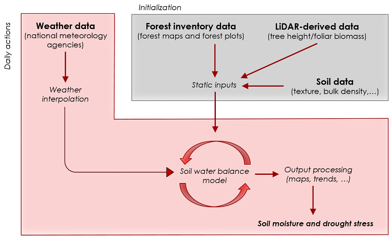
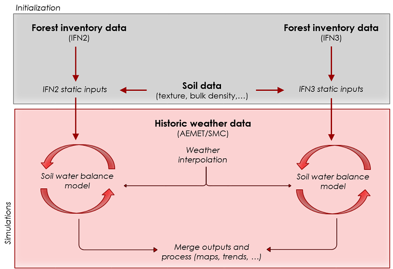

<!-- # Catalan Forest Drought Prediction Tool -->

<!-- *Miquel De Cáceres, Antoine Cabon, Jordi Martinez-Vilalta* -->

### Overview

This service offers model-based estimates of the historic (1986-2016), recent trends (up to 1 year) and projected scenarios (up to year 2100) in soil moisture levels of forests and drought stress of main tree species over Catalonia (NE Spain). Estimates are obtained using a soil water balance (SWB) model and forest plot data of the Spanish National Forest Inventory (De Cáceres et al. 2015). Water balance is done at the stand level only, neglecting lateral hydrological processes. The service complements monitoring programs of observed drought-related forest decline (mortality, decoloration and leaf loss) conducted in the same area (DEBOSCAT) (Chaparro et al. 2016).

### Soil water balance (SWB) model

The water balance model described in De Cáceres et al. (2015) (implemented in the *medfate* R package) follows the design principles from BILJOU (Granier et al. 1999) and SIERRA water balance submodel (Mouillot et al. 2001). The model performs daily updates of soil water content as a function of the stand structure and daily weather (radiation, temperature and precipitation). Soil water balance is the difference between processes determining water input (i.e. precipitation) and outputs (canopy interception, tree transpiration, bare soil evaporation, surface runoff and deep drainage). Details of the formulation of each of these processes are given in De Cáceres et al. (2015).

*Weather inputs*

The SWB model requires values of the following daily weather variables: precipitation, potential evapotranspiration (PET). Average daily temperature is also required to calculate growth degree days and update phenological status, but this variable is not currently stored.

Variable name	| Definition | Units | Aggreg.
------------- | ---------- | ----- | -------
PET	| Penman’s potential evapotranspiration	| mm/day	| Sum
Precipitation	| Precipitation	| mm/day	| Sum

---

*Forest water balance*

Every simulation day, the SWB model updates the leaf area index (LAI) of forests according to a simple phenology model and produces the following variables describing the water balance in forest stands:

Variable name	| Definition | Units | Aggreg.
------------- | ---------- | ----- | -------
NetPrec | NetPrecipitation | mm/day | Sum
Runoff | Surface (overland) runoff | mm/day | Sum
DeepDrainage | Deep drainage to groundwater | mm/day | Sum
LAI | Leaf area index (including all woody species) | m2/m2 | Average
Eplant | Plant transpiration | mm/day | Sum
Esoil | Soil evaporation | mm/day | Sum
Theta | Average soil moisture relative to field capacity. | [0-1] | Average

Net precipitation is gross precipitation minus the water intercepted by the canopy and evaporated from there. After going through the canopy, water infiltrates into the soil. Runoff is the amount of water that does not infiltrate and leaves the forest stand as an overland flow. Even if water infiltrates into the soil, part of it flows through macroscopic pores and is exported to layers not accessible to plants through deep drainage. Plant transpiration is the amount of water that flows through stems and is evaporated from leaf surfaces. Soil evaporation is the amount of water that is evaporated from the soil surface.

---

*Relative conductance and daily drought stress*

Plant transpiration depends on atmospheric demand, soil water content and species identities. Some species close suffer from drought stress at higher soil water contents than others. Whole-plant relative conductance is a relative measure of how much plant transpiration is reduced due to stress. The *daily drought stress* (DDS) index is defined as the complement ofthe whole-plant relative conductance. In other words, daily stress is higher when the species has a lower overall plant conductance (which can be due to a closure of stomata or the presence of emboli in vessels). For a given soil moisture level in a stand, plants present may experience different levels of drought stress depending on their species identity, root system,.... For each simulated forest stand, the daily drought stress for every species present is calculated by averaging daily drought stress of plant cohorts of the species, using LAI values as weights. The following species are tracked in terms of their daily stress.

Species        | Definition                          | Units | Aggreg.
--------------- | ----------------------------------- | ----- | -------
PinusHalepensis	| Drought stress for Pinus halepensis	| [0,1] | Average
PinusNigra | Drought stress for Pinus nigra | [0,1] | Average
PinusSylvestris | Drought stress for Pinus sylvestris | [0,1]| Average
PinusUncinata | Drought stress for Pinus uncinata | [0,1] | Average
PinusPinea | Drought stress for Pinus pinea | [0,1] | Average
PinusPinaster | Drought stress for Pinus pinaster | [0,1] | Average
QuercusIlex | Drought stress for Quercus ilex | [0,1] | Average
QuercusSuber | Drought stress for Quercus suber | [0,1] | Average
QuercusHumilis | Drought stress for Quercus humilis | [0,1] | Average
QuercusFaginea | Drought stress for Quercus faginea | [0,1] | Average
FagusSylvatica | Drought stress for Fagus sylvatica | [0,1] | Average
Overall | Average drought stress across all woody plants | [0,1] | Average

---

*Cumulative drought stress*

The cumulative effect of drought stress on forests is tracked by counting the *number of consecutive days* with daily drought stress values above 0.5 (i.e. less than 50% in conductance). Assuming that in the first of january stress will always be below 50%, within a year values of cumulative drought stress are therefore bounded between 0 and 365. Cumulative drought stress is represented for the same species (and overall) as in daily drought stress.

Species        | Definition                          | Units | Aggreg.
--------------- | ----------------------------------- | ----- | -------
PinusHalepensis	| Drought stress for Pinus halepensis	| [0,365] | Maximum
PinusNigra | Drought stress for Pinus nigra | [0,365] | Maximum
PinusSylvestris | Drought stress for Pinus sylvestris | [0,365]| Maximum
PinusUncinata | Drought stress for Pinus uncinata | [0,365] | Maximum
PinusPinea | Drought stress for Pinus pinea | [0,365] | Maximum
PinusPinaster | Drought stress for Pinus pinaster | [0,365] | Maximum
QuercusIlex | Drought stress for Quercus ilex | [0,365] | Maximum
QuercusSuber | Drought stress for Quercus suber | [0,365] | Maximum
QuercusHumilis | Drought stress for Quercus humilis | [0,365] | Maximum
QuercusFaginea | Drought stress for Quercus faginea | [0,365] | Maximum
FagusSylvatica | Drought stress for Fagus sylvatica | [0,365] | Maximum
Overall | Average drought stress across all woody plants | [0,365] | Maximum

---

### MODE 1: Current forest drought

In this mode, the water balance model is run once every day for each simulation location after gathering weather station data and interpolating weather over the target simulation location. Soil moisture and other state variables are stored from one day to the other, so that the accumulation of drought stress (or the relieving effect of precipitations) can be simulated.

The following diagram illustrates the workflow of tasks necessary for the initialization of the tool and every day actions:

---

*Simulation locations*

SWB simulations are conducted on two sets of locations:

1. 200 x 200 m pixels (384,000). 
2. IFN3 plots (11,454).

Simulation on pixels are only used for mapping purposes, whereas simulations on IFN3 plots are used to examine temporal trends.

*Initialization for IFN3 plots*

+ Two soil layers considered (topsoil and subsoil). Soil texture obtained from the Harmonized Soil World Data Base. Rock fragment content from forest plot surface rock abundance.
+ Height and leaf area index (LAI) of trees and shrubs from forest plot data. LAI estimated from allometric relationships including DBH and stand competition (Ameztegui, Cabon et al. 2017). 
+ Species parameterization includes, apart from allometric relationships, critical soil water potential thresholds that determine the reduction of transpiration with soil drying, leaf water interception, light extinction and growth degree days necessary for leaf development of deciduous species.
+ Soil depth and root distribution estimated as described in Cabon et al. (in prep.).

*Initialization of pixels*

Forest categories are first defined for 200x200m pixels and IFN3 plots according to the MFE50, using the first two dominant species and their occupation level. Each 200x200 m pixel is then assigned an IFN3 plot according to the following rules:

+ If only one IFN3 plot has the same forest category as the target pixel, this plot is chosen.
+ If there are several IFN3 plots with the same forest category but none is closer than 50 km, the closest one is chosen.
+	If there are one or several IFN3 plots with the same forest category and closer than 50 km, the IFN3 plot having the smallest difference in elevation with respect to the target pixel is chosen.

The imputation process of IFN3 plots to 200x200 m pixels may entail gross errors at this resolution, but it is intended to provide sound estimates when averaging the results of 200x200 m pixels at 1km resolution. The imputation of a IFN3 plot provides the species composition for the pixel, a preliminary estimate of forest structure, and soil/root distribution parameters. Tree heights and leaf area index of each tree cohort at each target pixel are then modified according to 20x20 m resolution layers of average tree height and foliar biomass that had been estimated from LiDAR data (0.5 pulses/m2) by CREAF [ref]. Specifically, these two layers are first upscaled to 200x200 m resolution and for each target pixel, the ratio between average height at the pixel corresponding to the location of the assigned IFN3 plot and average height at the target pixel is used to correct tree heights from plot data for the target pixel. Similarly, the ratio in foliar biomass is used to correct the leaf area index of trees for the target pixel.

*Climate forcing*

Weather station data of the current day is downloaded from APIs provided by the Spanish [Agencia Estatal de Meteorologia (AEMET)](https://opendata.aemet.es/centrodedescargas/inicio). This information, complemented with weather data from previous days, is used to interpolate weather variables over the simulation locations (pixels or IFN3 plots). Interpolation routines are implemented in package *meteoland*. 

*Mapping*

The spatial scope of displayed results is within Catalonia boundaries and at a maximum 2km distance from IFN3 plots. Two raster resolution levels and three display options are offered:

+ Smoothed 1 km2
+	1 km2
+	200 x 200 m

Values at 1km2 are calculated averaging 200 x 200 m pixels. Smoothing is done on 1 km2 pixels using a spatial kernel of radius 2 km (R package *spatstat*). Maps are usually displayed at the daily scale, but the user can decide to map values aggregated temporally up to a number of days Temporal aggregation follows the function (sum or average) indicated in variable tables above.

*Temporal trends*

Daily temporal trends are stored for IFN3 plots only (i.e. not for pixels). Average trends can be displayed at four spatial levels: (a) Watersheds; (b) Counties; (c) Municipalities; and (d) IFN3 plots. The user can select the desired spatial structure depending on each level. In the case of IFN3 plots the trends of the selected IFN3 plot are displayed. For the other levels, the application loads the trends of all the IFN3 plots within county/municipality boundaries and calculates average and 5%-95% confidence interval.

---

### MODE 2: Historic (1986-2016) forest drought

In this mode, the soil water balance model is used to simulate water balance for the historical period between 1986 and 2016. Unlike current-day simulations, climate change simulations are conducted for forest inventory plots only. Moreover, only monthly and yearly summaries are stored. 

*Simulation locations and initialization*

The second and third forest inventories in Spain (IFN2 and IFN3) are comparable in sampling methods. In Catalonia, IFN2 sampling was conducted between 1987 and 1991, whereas IFN3 sampling was conducted between 2000 and 2001. In order to simulate historic soil water balance and drought stress, simulations are run on both IFN2 and IFN3 plot data. Since IFN3 was more complete than IFN2, simulations using IFN2 plot data are restricted to those plots that were resampled in IFN3 (10,469 plots), even if in some cases the exact sampling location may have changed. For those 'common' plots, the simulation results are averaged assigning weights to IFN2 and IFN3 according to the year of simulation, as described in De Cáceres et al. (2015). For those IFN3 plots that do not have IFN2 counterpart, only the simulations with IFN3 data is used. Initialization procedure is the same as for current-day simulations.

The following diagram illustrates the workflow of tasks necessary for the initialization and simulations in the historic mode:

---

*Climate forcing*

Historic weather series for each forest plot is obtained by interpolating daily weather station data for the 1986-2016 period, using package *meteoland*. Surface weather station data was obtained from the [Agencia Estatal de Meteorologia (AEMET)](http://www.aemet.es) and [Servei Meteorologic de Catalunya (SMC)](http://www.meteo.cat).

---

### MODE 3: Forest drought under climate change scenarios

In this mode, the soil water balance model is used to project forest drought stress under climate change predictions. Unlike current-day simulations, climate change simulations are conducted for IFN3 plots only. Moreover, only monthly and yearly summaries are stored. Initialization procedure is the same as for current-day simulations.

*Climate forcing*

Climate scenarios were downloaded from [ESFG (Earth System Grid Federation](http://esgf.llnl.gov/), a web site that centralizes climate data from GCM and RCM uploaded in the frame of different international consortia, including the CORDEX regionalization project. Fifth assessment report (AR5) is used and RCP 4.5 and RCP 8.5 scenarios are used. Daily climate projections for the 2006-2100 period are used as forcing. They were produced by two regional climate models (CCLM4-7-13 and RCA4), both driven by the same global climate model (CNRM-CERFACS).

CGM             | RCM                     | Domain | RCP | Resolution
--------------- | ----------------------- | ------ | ------------ | ----------
CNRM-CERFACS	 | CCLM4-8-17	| Europe | 4.5 | 11 km
CNRM-CERFACS	 | CCLM4-8-17	| Europe | 8.5 | 11 km
CNRM-CERFACS	 | RCA4	| Europe | 4.5 | 11 km
CNRM-CERFACS	 | RCA4	| Europe | 8.5 | 11 km

---

Statistical downscaling is applied to daily climate data, which includes a bias correction. Bias correction is conducted using package *meteoland*, and requires a local historic meteorological series to use as reference for bias estimation. This is obtained by interpolating daily weather station data over IFN3 plots for the 1986-2005 period (station data from AEMET and SMC).

### Computational times

The following table provides an idea of current computational times of the different tasks:

MODE               | Task                          | Computational time | Parellized | Daily |
------------------ | ----------------------------- |:------------------:|:----------:|:-----:| 
MODE 1 (current)   | Initialization                |  10 min            | No         | No    |
MODE 1 (current)   | Plot meteo interpolation      |  1 min             | No         | Yes   |
MODE 1 (current)   | Plot soil water balance       |  2 min             | Yes        | Yes   |
MODE 1 (current)   | Plot update trends            |  2 min             | No         | Yes   |
MODE 1 (current)   | Pixel meteo interpolation     |  4 min             | Yes        | Yes   |
MODE 1 (current)   | Pixel soil water balance      |  3 min             | Yes        | Yes   | 
MODE 1 (current)   | Smoothing for maps            |  1 min             | No         | Yes   |
MODE 2/3           | Meteo interpolation 1986-2016 |  7 days            | No         | No    |
MODE 2 (historic)  | Soil water balance IFN2/IFN3  |  18 hours          | No         | No    |
MODE 2 (historic)  | Mapping                       |  2 hours           | No         | No    |
MODE 2 (historic)  | Trend mapping                 |  1 hour            | No         | No    |
MODE 3 (projection)| Bias correction & SWB         |  10 days           | No         | No    |
MODE 3 (projection)| Trend mapping                 |  10 hours          | No         | No    |

---

Daily routines in total account for 13 min of computation in a server with 8 cores.

---

### Known issues and potential improvements

*Known issues*

+ Historic meteo stations have zero precipitation records that suggest the need for quality check

*Potential improvements*

+ Replace plot-based historic meteo interpolation by 1km pixel-based over Catalonia for mapping purposes (¿?)
+ Soil input data from [SoilGrids](https://www.soilgrids.org)
+ Combine initialization IFN2 (1987-91), IFN3 (2000-2001) and IFN4 (2014) in historical simulations.
+ Use IFN4 (2014) in climate change simulations.
+ Validation/comparison with remote sensing data (SMOS, RWC).
+ Inclusion of hydraulic redistribution
+ Inclusion of lateral water fluxes.

---

### References

+ Ameztegui, A., Cabon, A., De Cáceres, M. & Coll, L. (2017). Managing stand density to enhance the adaptability of Scots pine stands to climate change: A modelling approach. Ecol. Modell., 356, 141–150.
+ De Cáceres, M., Martinez-Vilalta, J., Coll, L., Llorens, P., Casals, P., Poyatos, R., et al. (2015). Coupling a water balance model with forest inventory data to predict drought stress: the role of forest structural changes vs. climate changes. Agric. For. Meteorol., 213, 77–90.
+ Chaparro, D., Vayreda, J., Vall-llossera, M., Banque, M., Piles, M., Camps, A., et al. (2016). The Role of Climatic Anomalies and Soil Moisture in the Decline of Drought-Prone Forests. IEEE J. Sel. Top. Appl. Earth Obs. Remote Sens., 10, 503–514.
+ Granier, A., Bréda, N., Biron, P. & Villette, S. (1999). A lumped water balance model to evaluate duration and intensity of drought constraints in forest stands. Ecol. Modell., 116, 269–283.
+ Mouillot, F., Rambal, S. & Lavorel, S. (2001). A generic process-based SImulator for meditERRanean landscApes (SIERRA): design and validation exercises. For. Ecol. Manage., 147, 75–97.

---
